<div align="center">

# EA Healthcare Management System

**A full-stack healthcare platform for patients, doctors and the front desk.**
Fifteen Spring Boot microservices · React workspace with 40+ screens · AI-assisted health reports · telemedicine · runs entirely on localhost.

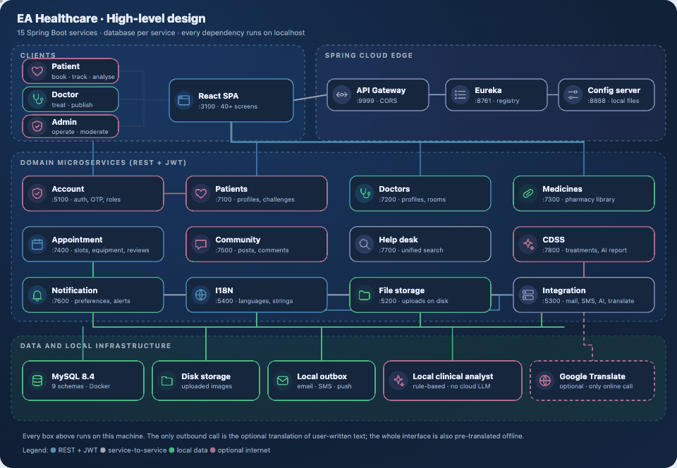

<sub>Live high-level design: packets show the real calls between services. Vector version: <a href="docs/diagrams/architecture.svg">architecture.svg</a></sub>

</div>

---

## At a glance

| | |
|---|---|
| **Backend** | 15 Spring Boot 3 services (Java 21), 41 controllers, 165 REST endpoints, 26 entities, ~16k lines |
| **Frontend** | React 18 on the Argon dashboard theme, 114 source files, ~17k lines, responsive down to phone width |
| **Data** | MySQL 8.4, one schema per service (36 patients, 16 doctors, 2011 appointments once seeded) |
| **Platform** | Eureka registry, Spring Cloud config (native files), API gateway, JWT with role-based routes |
| **Offline** | No cloud dependency. The only optional internet call is the translator for free-text posts |
| **Verification** | 12 end-to-end UI checks in headless Chrome, every route crawled per role, 46 screens captured |

## Run it in one command

Requirements: Docker, JDK 21, Node 18+, Google Chrome (only for tests and screenshots).

```bash
./docs/runner.sh 5        # clean -> docker + MySQL -> 15 services + web app -> seed demo data
```

`./docs/runner.sh` opens a menu:

| Option | What it does |
|---|---|
| **1) Cleanup** | Stops everything, removes the database container and its volume, clears logs and uploads |
| **2) Setup** | Starts MySQL 8.4 in Docker, builds the service jars and the frontend if missing |
| **3) Run** | Starts the 15 services in dependency order and serves the web app |
| **4) Seed** | Fills the system with realistic data through the real APIs |
| **5) Automate** | 1 → 2 → 3 → 4 |
| **s / x** | Status / stop services |

The first build downloads Gradle and npm dependencies once. After that, everything works with no internet.

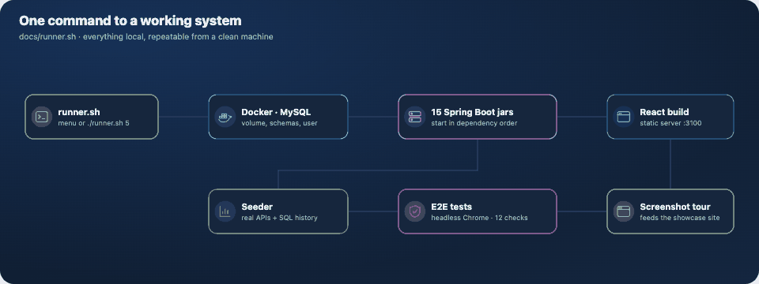

### Open the app

| What | URL |
|---|---|
| Web app | http://localhost:3100 |
| Local mailbox (OTP codes, reminders, alerts) | http://localhost:3100/common/mailbox |
| Eureka registry | http://localhost:8761 |
| Showcase #1: product case study | `cd docs/showcase && npm start` → http://localhost:4000 |
| Showcase #2: "Ward Round" clinical chart | http://localhost:4000/ward-round/ |
| Showcase #3: slide presentation (Mac monitor on desktop, phone on mobile) | http://localhost:4000/deck/ |
| Showcase #4: "One Take", a recorded film built from real frames and requests | http://localhost:4000/onetake/ |

### Demo accounts (created by the seeder)

| Role | Email | Password |
|---|---|---|
| Admin | `admin@healthcare.local` | `Admin@1234` |
| Doctor | `dr.farhat.snigdah@healthcare.local` | `Doctor@1234` |
| Patient | `eva.rahman@mail.healthcare.local` | `Patient@1234` |

All 54 accounts are listed in `docs/seeder/last-run.json` after seeding. New accounts start locked: the one-time code appears in the local mailbox.

## What it does

- **Patients**: book appointments with live capacity and delays, keep a health profile, follow wellness challenges, read an AI-assisted analysis of their treatment history, join video consultations, post in the community, get reminders.
- **Doctors**: set in-person / telemedicine / off per shift, manage the queue and delays, write structured treatment records, publish articles and first-aid guides, join calls.
- **Admins**: approve doctors, allocate rooms, book walk-in patients, manage users, equipment and the medicine library, read operational statistics, moderate the community.
- **Everyone**: unified search, medicine and equipment library, ten-language interface, notification preferences per channel.

## Architecture

| Service | Port | Responsibility |
|---|---|---|
| Account | 5100 | Login, JWT, OTP, roles, account status |
| File storage | 5200 | Uploads on local disk, served over HTTP |
| Integration | 5300 | Email / SMS / push outbox, local AI analyst, translator client |
| I18N | 5400 | Languages, interface strings, translations |
| Patients | 7100 | Profiles, health data, wellness challenges and progress |
| Doctors | 7200 | Profiles, credentials, room allocation, specializations |
| Medicines | 7300 | Pharmacy library |
| Appointment | 7400 | Schedules, booking, delays, reviews, equipment, reminders |
| Community | 7500 | Posts, comments, reactions |
| Notification | 7600 | Notifications and per-user preferences |
| Help desk | 7700 | Unified search |
| CDSS | 7800 | Treatments, similar-case search, AI report |
| API gateway / Eureka / Config | 9999 / 8761 / 8888 | Spring Cloud edge |

### Key flows

<table>
<tr>
<td width="50%"><b>Sign-up and secure login</b><br>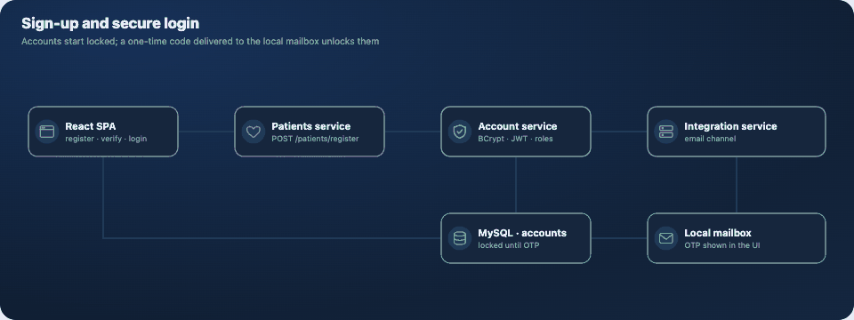</td>
<td width="50%"><b>Booking an appointment</b><br>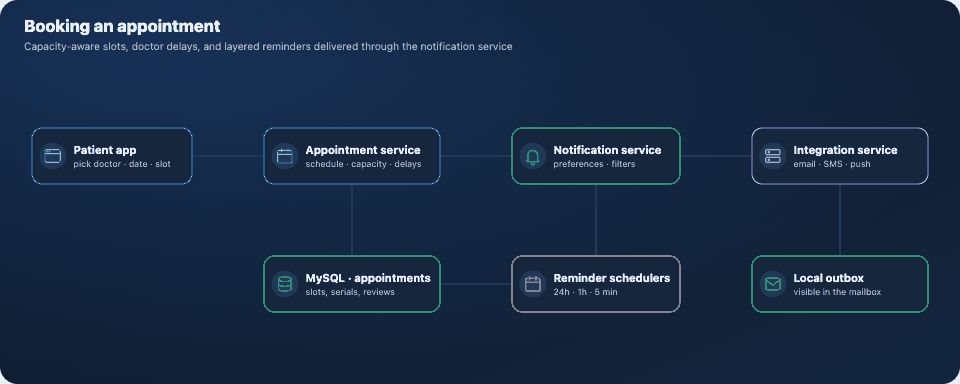</td>
</tr>
<tr>
<td><b>AI-assisted health report</b><br>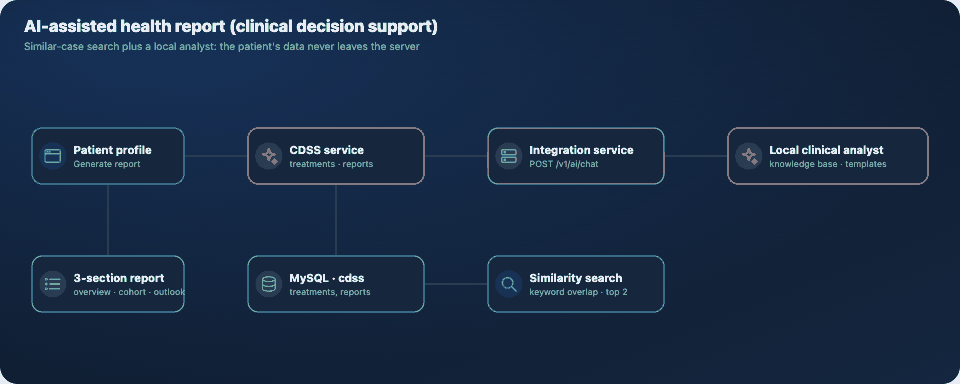</td>
<td><b>Telemedicine</b><br>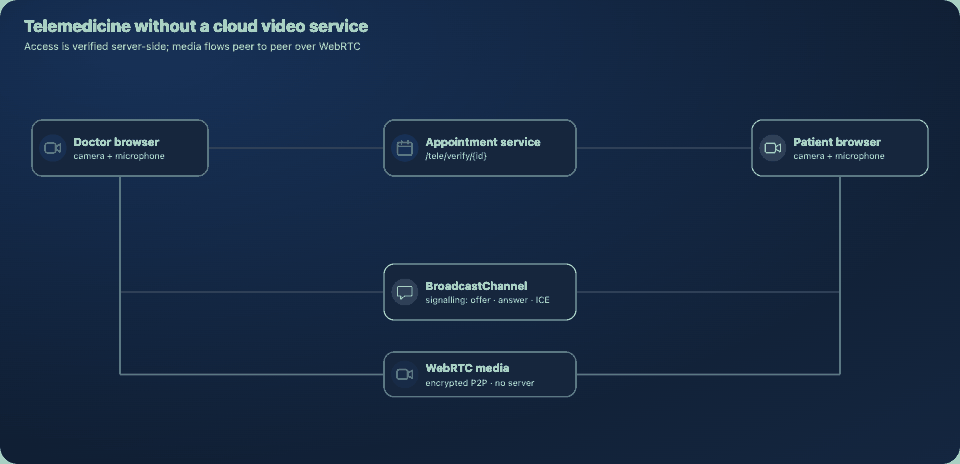</td>
</tr>
<tr>
<td colspan="2"><b>Offline-first translation</b><br>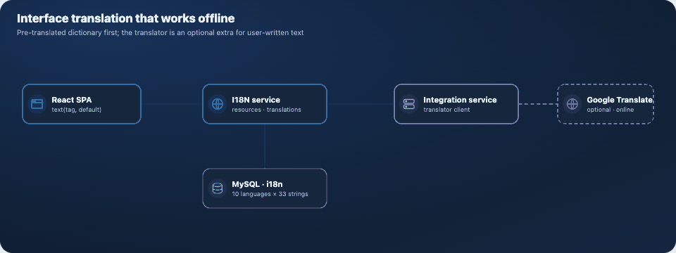</td>
</tr>
</table>

### How the cloud dependencies were replaced

| Was | Now |
|---|---|
| Azure Blob storage for photos | File service on local disk (`/files/<name>`) |
| SMTP, Twilio SMS, Firebase push | Outbox in the Integration service + mailbox page |
| Hosted GPT call for the health report | Local clinical analyst (knowledge base + templates) |
| Zego cloud video | WebRTC peer to peer, signalling through `BroadcastChannel` |
| Config server on a remote git repo | Config server with native local files |
| Google Fonts / Maps | System font stack, no map script |
| Stock images from the web | Generated SVG artwork |
| Translator for the whole UI | Pre-translated dictionary; translator kept for free text |

## Screens

The showcase sites in `docs/showcase` (a product tour and a clinical-chart case study, "Ward Round") present all 46 screens with captions. A few of them:

<table>
<tr>
<td>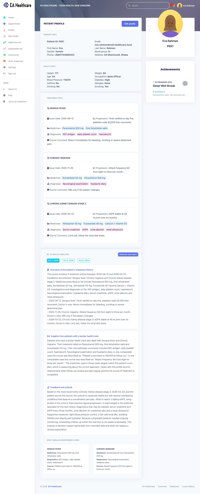<br><sub>AI health analysis</sub></td>
<td>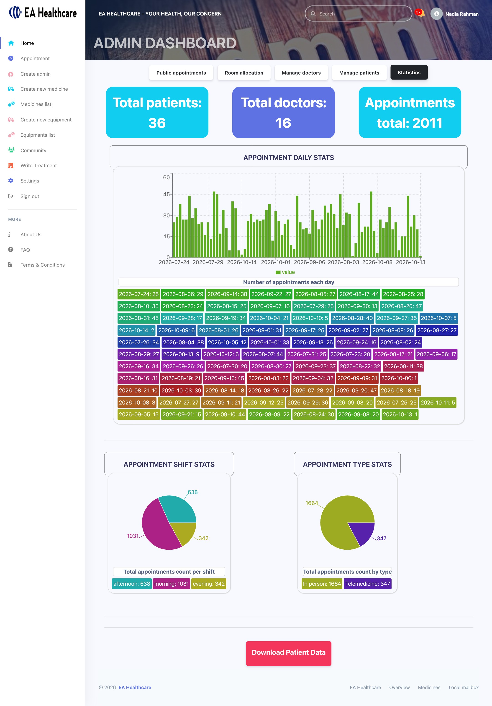<br><sub>Operational statistics</sub></td>
<td>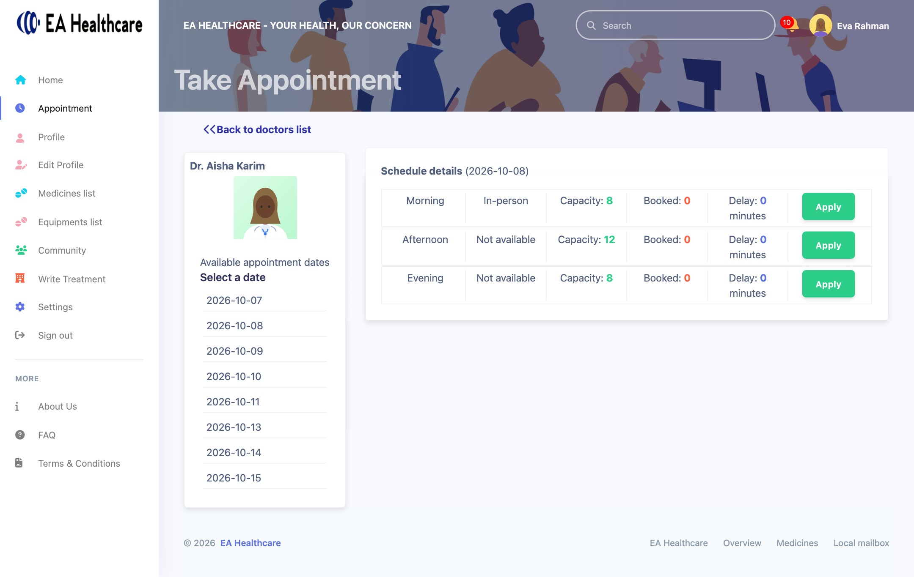<br><sub>Slot booking</sub></td>
</tr>
<tr>
<td>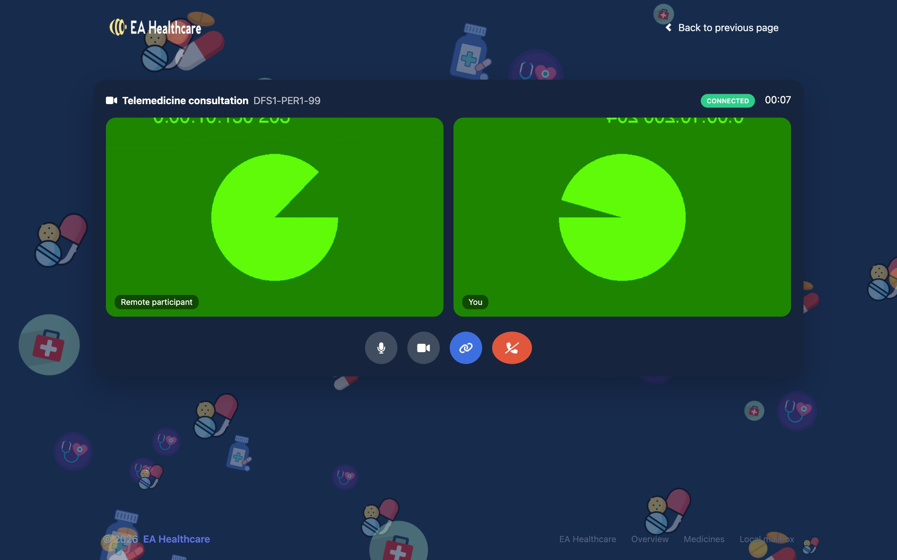<br><sub>Telemedicine call</sub></td>
<td>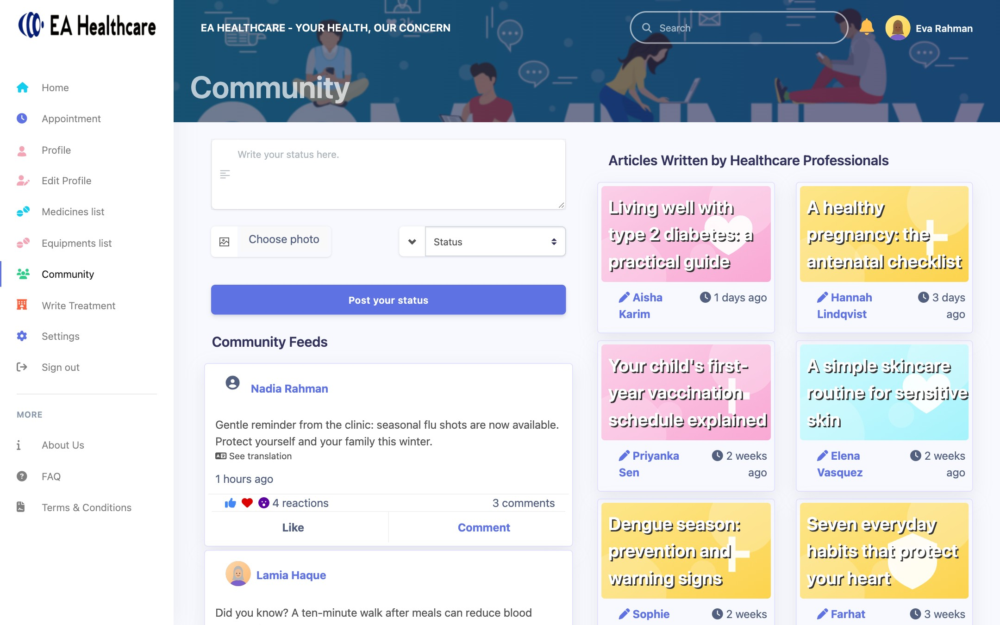<br><sub>Community</sub></td>
<td>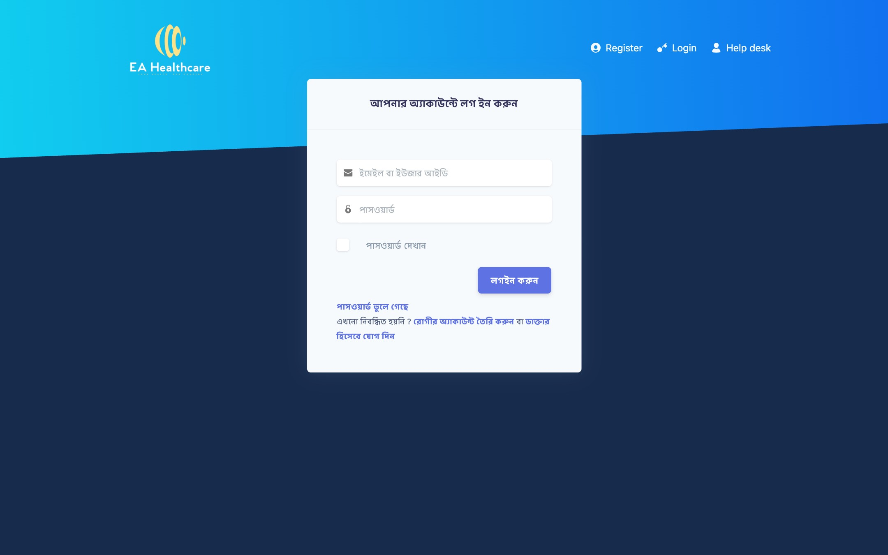<br><sub>Interface in Bengali</sub></td>
</tr>
</table>

## Engineering notes

A hardening pass made the project runnable end to end. Highlights (full list in the showcase site):

- Removed committed cloud credentials and replaced every integration with a local equivalent. **Rotate the keys that were in git history** (OpenAI, Twilio, Azure, Gmail app password, Firebase): they were exposed before this change.
- Fixed authorization rules that matched no real route (any signed-in user could deactivate or suspend accounts) and stopped persisting doctor passwords in plaintext.
- Fixed the AI report (it mutated managed JPA entities) and the inverted telemedicine join window.
- Replaced mock data in the doctor profile with real API data and wired features that only existed on paper (reactions, account verification, the AI report screen).
- Rewrote the i18n hook that looped requests forever.
- Dates are stored by the JDBC driver in UTC: the seeder converts when it writes history with SQL.

## Repository layout

```
BackEnd/                 15 Gradle modules (Spring Boot 3, Java 21)
  Configurations/        shared config served by the config server
FrontEnd/                React app (build is served on :3100)
docs/
  runner.sh              interactive menu / automation
  docker/                docker-compose.yml + schema init
  scripts/               backend.sh, frontend.sh, reset-data.sh, static server
  seeder/                seed.mjs, realistic data, translation dictionary
  tests/e2e.mjs          UI end-to-end checks (headless Chrome)
  diagrams/              animated SVG/GIF architecture and flows (+ generator)
  showcase/              portfolio site, screenshot tour, stats
```

## Testing

```bash
node docs/tests/e2e.mjs      # registers a user, verifies by OTP, resets a password, writes a treatment,
                             # generates an AI report, books an appointment, posts and comments, switches language
```

## Conventions

- **IDs**: patient `PSF2` (P + initials + serial), doctor `DFS1`, appointment `DFS1-PSF2-1` (doctor-patient-serial), walk-in `DFS1-ExP1`, medicine `MED1`, equipment `EQU1`, CDSS `C-PSF1-1`.
- **Ports**: major services 7xxx, extra services 5xxx, platform 8761 / 8888 / 9999, web 3100.

## Credits

Original project by Shartaz Yeasar Feeham. The UI is built on the open-source Argon Dashboard React theme (MIT).
